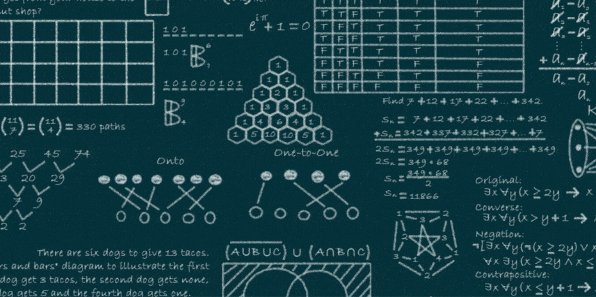

<h1>
  

  <b>🔗 DSA 📈</b>
    
  
  

</h1>

| Sr | Filename | Title       | Notes                        |
| ----------------------------------- | ------------------------------------- | ------------------------------------- | ------------------------------------------------------ |
| 1                                   | 2-1_datatypes_and_modifiers.cpp       | Datatypes and Modifiers               | Type modifiers explained                               |
| 2                                   | 2-2_input_output.cpp                  | stdin and stdout                      | _Lollipop_                                             |
| 3                                   | 2-3_maxOfThree.cpp                    | if else elseif                        | Ternery Operator                                       |
| 4                                   | 2-4_loops.cpp                         | for while doWhile                     | Guessing game, factorial and reversing num             |
| 5                                   | 3-1_breakContinue.cpp                 | Break and Continue                    | Prime Numbers in a range                               |
| 6                                   | 3-2_switchCase.cpp                    | Switch Case                           | Upper to Lowercase Hack                                |
| 7                                   | 3-3_operators.cpp                     | Operators in C++                      | PUMAS REBL TAC                                         |
| 8                                   | 4-1_patterns1.cpp                     | Patterns Part 1                       | Butterfly, Floyd pyramid, etc                          |
| 9                                   | 4-2_patterns2.cpp                     | Patterns Part 2                       | Zig Zag, Rhombus, Double Pyramid, Pallindromic Pattern |
| 10                                  | 5-1_binaryNumberSystem.cpp            | Binary Number system theory           | Not a lot of code, just theory material                |
| 11                                  | 5-2_primeReverseArmstrong.cpp         | Prime Reverse Armstrong               | Prime Reverse Armstrong                                |
| 12                                  | 6-1_functions.cpp                     | Intro to functions and call stack     | Little code, more theory                               |
| 13                                  | 6-2_functionChallenge.cpp             | Pascal Tri, Binomial Coeff, Factorial | Function challenge                                     |
| 14                                  | 6-3_advancedFunctionChallenge.cpp     | Function Challenges                   | Number systems conversion[*]                           |
